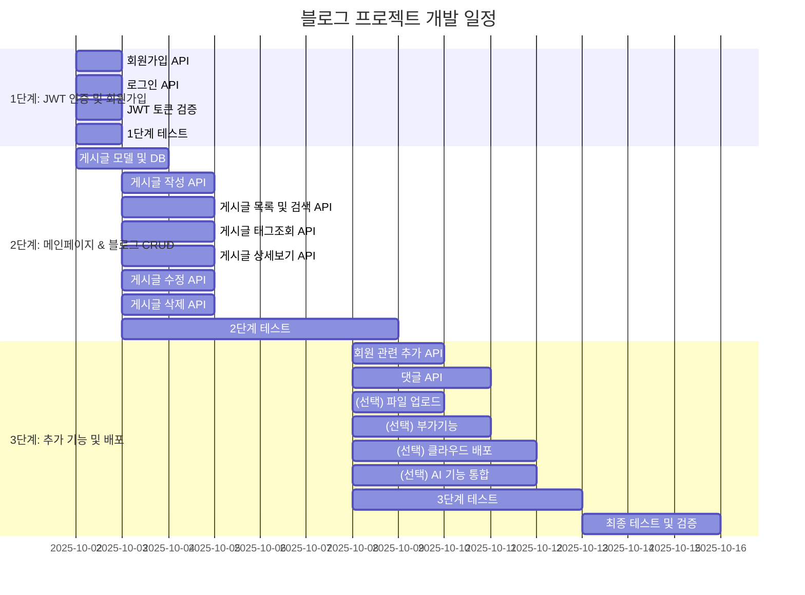
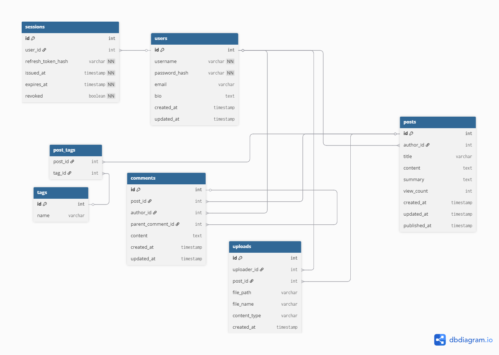

# modu_blog_project
모두의연구소 백엔드 5기 블로그 제작 팀 프로젝트

## 폴더 구조
```
blog-project/
├─ back/                        # 백엔드 (FastAPI 서버)
│   ├─ app/
│   │   ├─ main.py              # FastAPI 실행 진입점
│   │   ├─ core/
│   │   │   └─ database.py      # DB 연결 관리
│   │   ├─ models/              # SQLAlchemy 모델 정의
│   │   │   ├─ __init__.py
│   │   │   ├─ base.py
│   │   │   ├─ user.py
│   │   │   ├─ post.py
│   │   │   ├─ comment.py
│   │   │   ├─ session.py
│   │   │   ├─ tag.py
│   │   │   ├─ post_tag.py
│   │   │   └─ upload.py
│   │   ├─ schemas/             # Pydantic 스키마
│   │   │   ├─ user.py
│   │   │   ├─ session.py
│   │   │   ├─ post.py
│   │   │   ├─ comment.py
│   │   │   ├─ tag.py
│   │   │   └─ upload.py
│   │   ├─ utils/               # 여러 유틸 함수들
│   │   │   └─ auth_utils.py
│   │   └─ routers/             # API 라우터 모듈
│   │       ├─ auth.py
│   │       ├─ blog.py
│   │       └─ comment.py
│   └─ tests/
├─ front/                       # 프론트엔드 파트 폴더
│   ├─ index.html                 # 로그인 화면
│   ├─ signup.html                # 회원가입 화면
│   ├─ main.html                  # 블로그 메인 화면
│   ├─ post.html                  # 게시글 화면 (상세보기)
│   ├─ post_create.html           # 게시글 작성 화면
│   ├─ post_edit.html             # 게시글 수정 화면
│   ├─ profile.html               # 나의 프로필 화면
│   ├─ profile_edit.html          # 프로필 변경 화면
│   ├─ password_change.html       # 비밀번호 변경 화면
│   ├─ tag_search.html            # 태그 검색 결과 화면
│   ├─ css/
│   │   └─ style.css              # 공용 스타일
│   │   
│   └─ js/
│       ├─ auth.js                # 로그인, 회원가입, 토큰 처리
│       ├─ main.js                # 블로그 메인 화면 관련 JS
│       ├─ post.js                # 게시글 화면 관련 JS (댓글, 대댓글)
│       ├─ post_create.js         # 게시글 작성 화면 JS
│       ├─ post_edit.js           # 게시글 수정 화면 JS
│       ├─ profile.js             # 프로필 화면 JS
│       ├─ profile_edit.js        # 프로필 변경 화면 JS
│       ├─ password_change.js     # 비밀번호 변경 화면 JS
│       └─ tag_search.js          # 태그 검색 결과 화면 JS
│
├─ docs/                        # 문서(md 파일 등) 저장
├─ static/
│   └─ images/                  # 이미지 (문서/웹 리소스 공용)
├─ requirements.txt             # Python 의존성 (FastAPI, SQLAlchemy 등)
├─ .gitignore                   # git에서 제외할 파일/폴더 설정 (venv, __pycache__, .env 등)
├─ .env.example                 # 환경 변수 예시 파일 (DATABASE_URL, SECRET_KEY)
└─ README.md                    # 프로젝트 개요 및 실행 방법 문서

```

## 🗂️ WBS(Work Breakdown Structure)


## 📌와이어프레임(Wireframe)


## 📌 URL 구조
| 구분                  | Method | Endpoint                                        | 기능 설명                  | JWT 인증 필요  |
| ------------------- | ------ | ----------------------------------------------- | ---------------------- | ------ |
| **Auth (회원 관련)**    | POST   | `/auth/register`                                | 회원가입                   | ❌      |
|                     | POST   | `/auth/login`                                   | 로그인, JWT 발급            | ❌      |
|                     | PUT    | `/auth/password`                                | 비밀번호 변경                | ✅      |
|                     | PUT    | `/auth/profile`                                 | 프로필 수정 (닉네임 등)         | ✅      |
|                     | GET    | `/auth/me`                                      | 내 정보 조회                | ✅      |
|                     | POST    | `/auth/logout`                                      | 로그아웃                | ✅      |
| **Blog (게시글)**      | POST   | `/blog`                                         | 게시글 작성                 | ✅      |
|                     | GET    | `/blog`                                         | 게시글 목록 조회 (검색, 정렬 지원)  | ❌      |
|                     | GET    | `/blog/tag/{tag_name}`                                   | 특정 태그의 게시글 목록 조회       | ❌      |
|                     | GET    | `/blog/{post_id}`                               | 게시글 상세 조회              | ❌      |
|                     | PUT    | `/blog/{post_id}`                               | 게시글 수정 (작성자 본인만 가능)    | ✅      |
|                     | DELETE | `/blog/{post_id}`                               | 게시글 삭제 (작성자 본인만 가능)    | ✅      |
| **Comment (댓글)**    | POST   | `/blog/{post_id}/comments`                      | 댓글 작성                  | ✅      |
|                     | GET    | `/blog/{post_id}/comments`                      | 댓글 목록 조회               | ❌      |
|                     | PUT    | `/blog/{post_id}/comments/{comment_id}`         | 댓글 수정 (작성자 본인만 가능)     | ✅      |
|                     | DELETE | `/blog/{post_id}/comments/{comment_id}`         | 댓글 삭제 (작성자 본인만 가능)     | ✅      |
|                     | POST   | `/blog/{post_id}/comments/{comment_id}/replies` | 대댓글 작성                 | ✅      |
| **Upload (파일 업로드)** | POST   | `/upload/images`                                | 이미지 업로드 (로컬/S3)        | ✅      |
| **Extra (부가기능)**    | GET    | `/blog/{post_id}`                               | 조회수 자동 증가              | ❌      |
|                     | GET    | `/docs`, `/redoc`                               | API 문서(Swagger, ReDoc) | ❌      |
|                     | GET    | `/static/...`                                   | 정적 파일 서빙               | ❌      |
| **AI 기능**      | POST   | `/ai/autocomplete`                              | 글 자동완성                 | ❌      |
|                     | POST   | `/ai/summarize`                                 | 게시글 요약                 | ❌      |
|                     | POST   | `/ai/tags`                                      | 태그 자동 추천               | ❌      |


## 📝 ERD



```
front/
├─ index.html                 # 로그인 화면
├─ signup.html                # 회원가입 화면
├─ main.html                  # 블로그 메인 화면
├─ post.html                  # 게시글 화면 (상세보기)
├─ post_create.html           # 게시글 작성 화면
├─ post_edit.html             # 게시글 수정 화면
├─ profile.html               # 나의 프로필 화면
├─ profile_edit.html          # 프로필 변경 화면
├─ password_change.html       # 비밀번호 변경 화면
├─ tag_search.html            # 태그 검색 결과 화면
├─ css/
│   └─ style.css              # 공용 스타일
│   
├─ js/
│   ├─ auth.js                # 로그인, 회원가입, 토큰 처리
│   ├─ main.js                # 블로그 메인 화면 관련 JS
│   ├─ post.js                # 게시글 화면 관련 JS (댓글, 대댓글)
│   ├─ post_create.js         # 게시글 작성 화면 JS
│   ├─ post_edit.js           # 게시글 수정 화면 JS
│   ├─ profile.js             # 프로필 화면 JS
│   ├─ profile_edit.js        # 프로필 변경 화면 JS
│   ├─ password_change.js     # 비밀번호 변경 화면 JS
│   └─ tag_search.js          # 태그 검색 결과 화면 JS
```