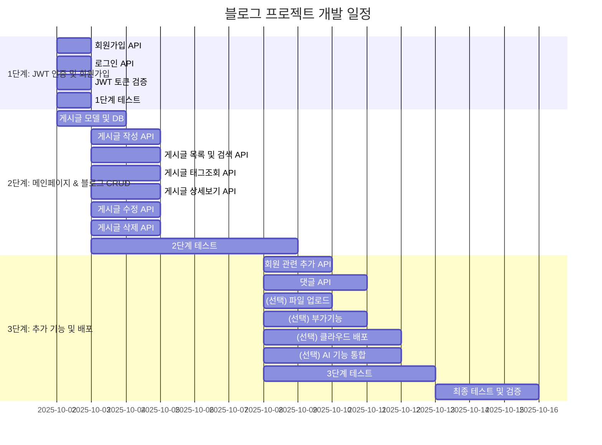

# modu_blog_project
모두의연구소 백엔드 5기 블로그 제작 팀 프로젝트

## 🗂️ WBS(Work Breakdown Structure)

```mermaid
gantt
    title 블로그 프로젝트 개발 일정
    dateFormat  YYYY-MM-DD
    section 1단계: JWT 인증 및 회원가입
    회원가입 API           :a1, 2025-10-02, 1d
    로그인 API            :a2, 2025-10-02, 1d
    JWT 토큰 검증          :a3, 2025-10-02, 1d
    1단계 테스트            :a4, 2025-10-02, 1d

    section 2단계: 메인페이지 & 블로그 CRUD
    게시글 모델 및 DB       :a5, 2025-10-02, 2d
    게시글 작성 API        :a6, 2025-10-03, 2d
    게시글 목록 및 검색 API :a7, 2025-10-03, 2d
    게시글 태그조회 API     :a8, 2025-10-03, 2d
    게시글 상세보기 API     :a9, 2025-10-03, 2d
    게시글 수정 API        :a10, 2025-10-03, 2d
    게시글 삭제 API        :a11, 2025-10-03, 2d
    2단계 테스트           :a12, 2025-10-03, 6d

    section 3단계: 추가 기능 및 배포
    회원 관련 추가 API      :a13, 2025-10-08, 2d
    댓글 API               :a14, 2025-10-08, 3d
    (선택) 파일 업로드       :a15, 2025-10-08, 2d
    (선택) 부가기능          :a16, 2025-10-08, 3d
    (선택) 클라우드 배포     :a17, 2025-10-08, 4d
    (선택) AI 기능 통합      :a18, 2025-10-08, 4d
    3단계 테스트             :a19, 2025-10-08, 5d
    최종 테스트 및 검증       :a20, 2025-10-13, 3d

```