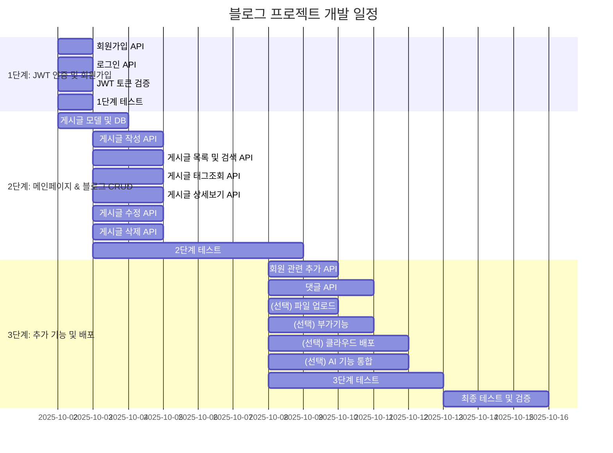

# modu_blog_project
모두의연구소 백엔드 5기 블로그 제작 팀 프로젝트

## 🗂️ WBS(Work Breakdown Structure)

## 📌와이어프레임(Wireframe)

첫번째, 두번째 페이지는 회원가입 & 로그인 페이지입니다

세번째 페이지는 블로그의 메인 화면입니다.

네번째 페이지는 사용자가 새 글 작성을 할수있는 페이지입니다.

다섯번째 페이지는 다른 사용자의 게시글 상세 정보 및 게시글내에 댓글 작성하는 화면입니다. (게시글 상세 페이지)

여섯번쨰 페이지는 본인이 작성한 게시글 수정 및 삭제할수있는 화면입니다. (게시글 수정/삭제 페이지)

일곱번째 페이지는 게시글 검색 화면입니다. (검색 결과 페이지)

여덟번째는 본인의 프로필 수정하거나 탈퇴할수 있는 페이지입니다. (사용자 프로필 페이지)

아홉번째도 정보 변경하는 페이지입니다. (프로필 수정 페이지)

## 📌 URL 구조
| 구분                  | Method | Endpoint                                        | 기능 설명                  | JWT 인증 필요  |
| ------------------- | ------ | ----------------------------------------------- | ---------------------- | ------ |
| **Auth (회원 관련)**    | POST   | `/auth/register`                                | 회원가입                   | ❌      |
|                     | POST   | `/auth/login`                                   | 로그인, JWT 발급            | ❌      |
|                     | PUT    | `/auth/password`                                | 비밀번호 변경                | ✅      |
|                     | PUT    | `/auth/profile`                                 | 프로필 수정 (닉네임 등)         | ✅      |
|                     | GET    | `/auth/me`                                      | 내 정보 조회                | ✅      |
| **Blog (게시글)**      | POST   | `/blog`                                         | 게시글 작성                 | ✅      |
|                     | GET    | `/blog`                                         | 게시글 목록 조회 (검색, 정렬 지원)  | ❌      |
|                     | GET    | `/blog/{tag}`                                   | 특정 태그의 게시글 목록 조회       | ❌      |
|                     | GET    | `/blog/{post_id}`                               | 게시글 상세 조회              | ❌      |
|                     | PUT    | `/blog/{post_id}`                               | 게시글 수정 (작성자 본인만 가능)    | ✅      |
|                     | DELETE | `/blog/{post_id}`                               | 게시글 삭제 (작성자 본인만 가능)    | ✅      |
| **Comment (댓글)**    | POST   | `/blog/{post_id}/comments`                      | 댓글 작성                  | ✅      |
|                     | GET    | `/blog/{post_id}/comments`                      | 댓글 목록 조회               | ❌      |
|                     | PUT    | `/blog/{post_id}/comments/{comment_id}`         | 댓글 수정 (작성자 본인만 가능)     | ✅      |
|                     | DELETE | `/blog/{post_id}/comments/{comment_id}`         | 댓글 삭제 (작성자 본인만 가능)     | ✅      |
|                     | POST   | `/blog/{post_id}/comments/{comment_id}/replies` | 대댓글 작성                 | ✅      |
| **Upload (파일 업로드)** | POST   | `/upload/images`                                | 이미지 업로드 (로컬/S3)        | ✅      |
| **Extra (부가기능)**    | GET    | `/blog/{post_id}`                               | 조회수 자동 증가              | ❌      |
|                     | GET    | `/docs`, `/redoc`                               | API 문서(Swagger, ReDoc) | ❌      |
|                     | GET    | `/static/...`                                   | 정적 파일 서빙               | ❌      |
| **AI 기능**      | POST   | `/ai/autocomplete`                              | 글 자동완성                 | ❌      |
|                     | POST   | `/ai/summarize`                                 | 게시글 요약                 | ❌      |
|                     | POST   | `/ai/tags`                                      | 태그 자동 추천               | ❌      |
