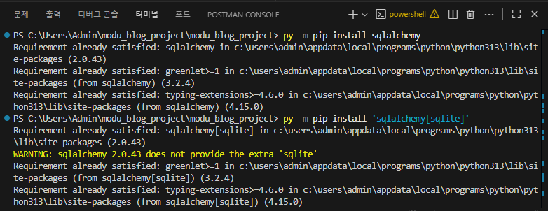
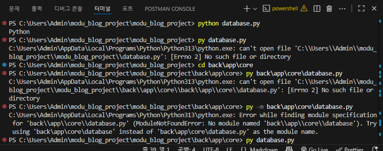
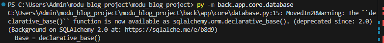

# 데이터베이스 설정 및 확인 가이드




## 1. 필수 모듈 설치

`sqlalchemy`와 데이터베이스 드라이버를 설치하세요.

```bash
pip install sqlalchemy
pip install 'sqlalchemy[sqlite]'  # SQLite 사용 시
```

## 2. 코드 실행

이전에 작성한 `database.py` 파일을 실행하여 테이블이 생성되도록 합니다.

```bash
python database.py
```

## 3. 데이터베이스 확인

`database.py`를 실행하면 `blog.db` 파일이 생성됩니다. 이 파일을 **DB Browser for SQLite**와 같은 GUI 도구나 **SQLite CLI**를 사용하여 열어보세요.

### DB Browser for SQLite 사용

이 도구를 사용하면 생성된 `blog.db` 파일을 쉽게 열어서 테이블 목록(`users`, `posts`, `comments` 등)과 각 테이블의 스키마(컬럼명, 데이터 타입)가 ERD와 일치하는지 시각적으로 확인할 수 있습니다.




명령어 실행을 하고, 위와 같은 에러가 났을때는 




명령어가 정상적으로 작동이 된다면 위와 같은 결과가 나옵니다. (단, 제가 일단 다 수정해놓은 상태라서 명령어만 실행시키시면 될것같아요 !!)
